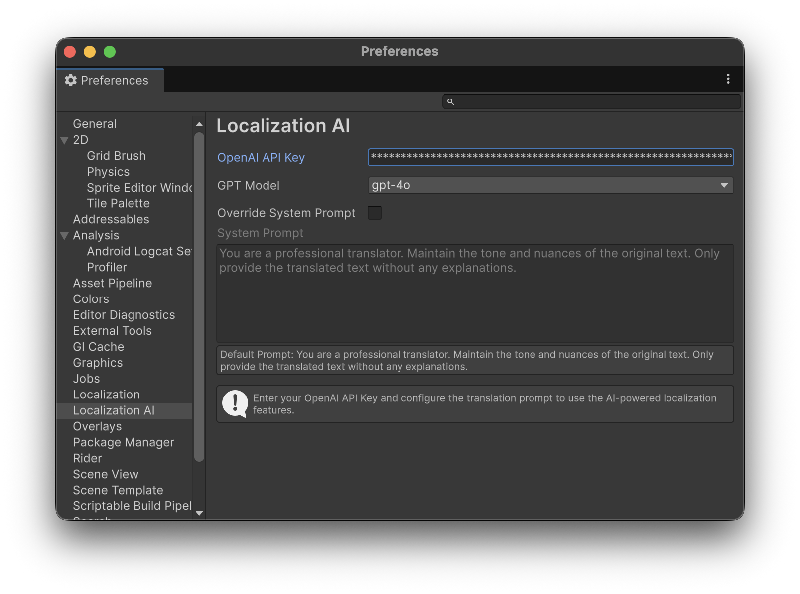

# Localization AI for Unity

An AI-powered localization tool for Unity's Localization package, using OpenAI's GPT models to automate string table translations.

## Features

- **Automated Batch Translation**: Translate multiple String Table Collections at once.
- **Context-Aware AI**: Uses GPT-4o and other models for high-quality, nuanced translations.
- **Flexible Configuration**: Choose your source and target locales dynamically.
- **Customizable Prompts**: Override the system prompt to fine-tune the AI's persona and translation rules.
- **Translation Preview**: Test translations for specific text before running a batch process.
- **Existing Translation Management**: Choose whether to keep or overwrite existing translations.

## Requirements

- **Unity 2022.3** or later (Tested on Unity 6)
- **Unity Localization Package** (`com.unity.localization`)
- **OpenAI API Key**

## Installation

You can install this package via Unity Package Manager using the Git URL:

1. Open the **Package Manager** window.
2. Click the **+** button and select **Add package from git URL...**.
3. Enter the following URL:
   `https://github.com/YourUsername/Unity-Localization-AI.git?path=/com.unity.localization.ai`

## Setup

### 1. Configure OpenAI API Key
Go to **Unity Preferences > Localization AI** and enter your OpenAI API Key. You can also select your preferred GPT model (e.g., `gpt-4o`, `gpt-4o-mini`).

### 2. Set Up Locales
Ensure your project has the **Unity Localization** package configured with at least two Locales (Source and Target).

## How to Use

### 1. Open the Localization AI Window
Navigate to **Window > Asset Management > Localization AI**.

### 2. Select Locales and Tables
- **Source Locale**: The language you are translating from.
- **Target Locale**: The language you want to translate into.
- **Overwrite Existing Translation**: Check this if you want the AI to replace strings that already have translations.
- **Select Tables**: Toggle the checkboxes for the String Table Collections you wish to process.

### 3. Test Translation (Optional)
Use the **Test Translation Preview** panel to see how the AI handles a specific piece of text before starting the full process.

### 4. Start Translation
Click **Start Translation Process**. A progress bar will appear, and the AI will begin populating your target tables.

## Customizing Translation Rules

If you need the AI to follow specific rules (e.g., "Keep technical terms in English", "Use a polite tone"), you can enable **Override System Prompt** in **Preferences > Localization AI**.

## License
This library is under the MIT License.